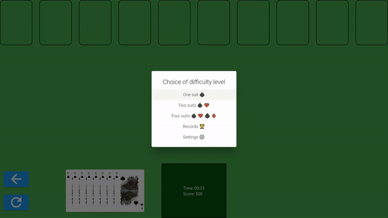

<h1>Spider Solitaire</h1>

Flutter spider solitaire app

---

## Dependencies

* [Dart](https://dart.dev/)
* [Flutter](https://flutter.dev/)
* [playing_cards](https://pub.dev/packages/playing_cards)

## Controls

<table>
<thead>
<tr><th>Keyboard shortcut</th><th>Description</th></tr>
</thead>
<tbody>
<tr><td><kbd>Left Ctrl</kbd> + <kbd>R</kbd></td><td>Open the restart dialog box</td></tr>
<tr><td><kbd>Left Ctrl</kbd> + <kbd>Z</kbd></td><td>Undo</td></tr>
</tbody>
</table>